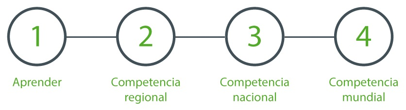

### ¿Cómo funciona la competencia?
La competencia es de carácter individual, e involucra resolver problemas a través de programas computacionales, utilizando los lenguajes C, C++ o Pascal. 

La OCI se desarrolla en dos etapas e involucra escuelas de formación para introducir a los concursantes a la programación, o mejorar las habilidades que ya poseen. La primera etapa es distribuida en distintas ciudades.
 
Para el 2016, las ciudades que se han sumado a los talleres de preparación OCI son Arica, Iquique, Valparaíso, Santiago, Curicó, Talca, Chillán, Concepción y Temuco. Todas ellas serán sedes de la Competencia Regional del sábado 8 de octubre (simultáneamente en todo el país).
 
Cada sede clasifica un determinado número de estudiantes (según participación y desempeño) a la segunda etapa, la Competencia Nacional de la OCI, que este año se realiza el sábado 12 de noviembre en la Universidad Técnica Federico Santa María (campus Santiago).
 
Los participantes con mejor desempeño en la final nacional pasan a formar parte del equipo nacional y son invitados a un campamento de entrenamiento avanzado a llevarse a cabo durante enero de 2017. De los integrantes del equipo nacional se seleccionan los 4 representantes de Chile en la IOI 2017 (Teherán, Irán).
